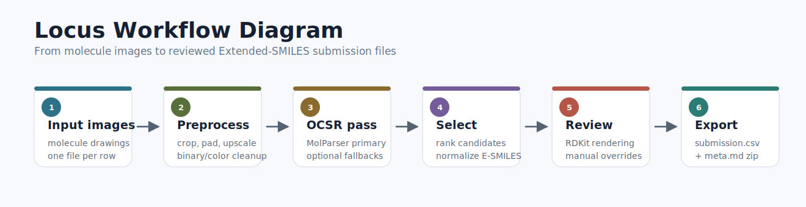
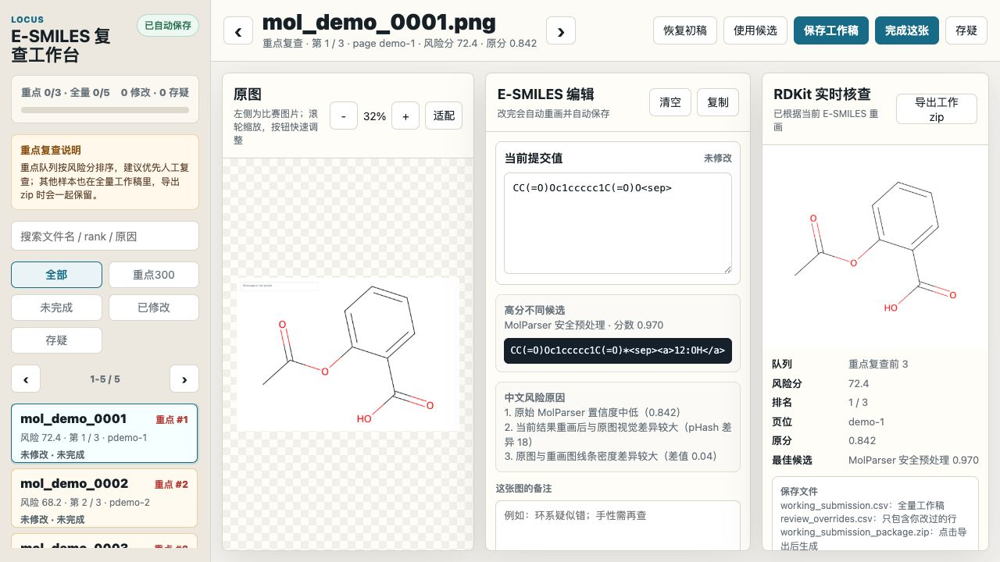
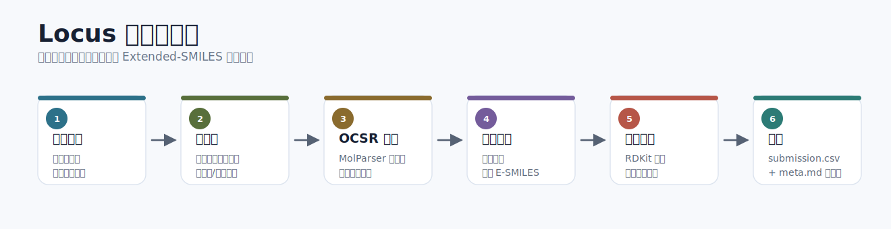

# Locus

[中文说明点这里](#locus-中文说明)

Locus is an open-source workflow for optical chemical structure recognition (OCSR) and E-SMILES submission packaging. It was prepared for [Bohrium Science Data Annotation Competition, Track 1](https://www.bohrium.com/competitions/53859761357?tab=introduce), where each molecule image must be converted into an Extended-SMILES result.

The project is designed as a practical competition toolkit rather than a single neural network. It batches recognition requests, generates safer image variants, merges multiple model outputs, renders predictions back into molecule images, and builds the final `submission.csv` + `meta.md` zip expected by the competition platform.

This repository does **not** include the official competition images, private submission files, generated zip packages, third-party model weights, or proprietary MolParser service code.

## Workflow Diagram

<p align="center">
  
</p>

## Why "Locus"?

The name comes from the idea of a mind palace. A mind palace is also known as the method of loci: a memory technique that places ideas into imagined locations so they can be found, checked, and recalled. The word `loci` is the plural of the Latin `locus`, meaning a place, position, or location.

## What It Does

- Sends molecule images to the public MolParser OCSR endpoint and stores resumable CSV results.
- Creates preprocessing variants such as crop, padding, upscaling, binary cleanup, and color-foreground extraction for difficult images.
- Optionally runs local MolScribe or DECIMER helpers when they are installed separately.
- Normalizes model outputs into the competition's E-SMILES style.
- Uses RDKit to check whether the base SMILES is parseable.
- Renders predicted structures back to images and produces visual review sheets for human audit.
- Opens a local review workbench for comparing original molecule images with rendered E-SMILES and saving human corrections.
- Builds a platform-ready zip containing only `submission.csv` and `meta.md`.

## Start Here

In three sentences:

- Locus turns molecule images into E-SMILES submission drafts.
- Locus Review opens a local browser workbench where a human can compare the source image with an RDKit rendering and correct the E-SMILES.
- The repository contains workflow code and review-tool code, but not private competition images, final submissions, generated portable zips, or third-party service code.

| If you want to... | Go here first | You will use |
| --- | --- | --- |
| Run the OCSR workflow | Quick Start | `tools/run_molparser_api.py`, `tools/run_molparser_variants.py`, `tools/make_submission.py` |
| Review and correct an existing submission | Locus Review Workbench | `tools/review_edit_server.py`, `tools/launch_review_editor.py` |
| Package a corrected answer | Locus Review Workbench or Quick Start | `final_review_editor/working_submission_package.zip` or `tools/make_submission.py` |
| Understand private-data boundaries | Data Preparation, Third-Party Tools and Licenses | local `data/`, `work/`, and `final_review_editor/` folders |

## Review Tool Preview

The screenshots below use the bundled public demo dataset in `examples/demo/`. They do not contain competition images or private submissions.

<p align="center">
  
  <br>
  <sub>Full local review workbench: queue, original image, editable E-SMILES, and live RDKit rendering.</sub>
</p>

The workbench is built around a simple review loop: pick a risky sample, compare the original image with the RDKit rendering, edit the E-SMILES, then let the tool autosave the full working CSV.

| Area | What you see | What it is for |
| --- | --- | --- |
| Left rail | Risk queue, search, filters, progress, changed/flagged counts | Move through high-risk samples first, then review or search the full dataset |
| Original image | The source molecule image with zoom and fit controls | Compare the visual structure, labels, rings, and stereochemistry against the prediction |
| E-SMILES editor | Editable submission value, candidate result, Chinese risk reasons, notes | Correct the row while keeping the competing candidates and audit hints nearby |
| RDKit check | Live rendering, sample metadata, export controls | Verify the edited E-SMILES visually and export the full corrected package |

### Demo Quick Start

To open the same demo screen shown above:

```bash
python tools/launch_review_editor.py --demo
```

The demo uses five synthetic molecule images generated for this repository. Review output is written to your temporary folder, so trying the demo will not edit private competition files.

## Locus Review Workbench

Locus Review is a local browser workbench for human correction of E-SMILES predictions. It is not a hosted service; it runs on `127.0.0.1`, reads local files, and saves a local working CSV.

The workbench is sibling-born with [HailBerry](https://github.com/Shawn-TV/HailBerry). Both projects use the same review philosophy: model outputs are drafts, the browser UI is a local workstation, and human review is the final authority. HailBerry Review focuses on reaction-image JSON annotations, while Locus Review focuses on molecule-image E-SMILES correction.

The interface has three working areas:

- Left: sample list, risk filters, search, page controls, and review progress.
- Middle: original molecule image with zoom and fit controls.
- Right: E-SMILES editor, candidate/risk notes, RDKit rendering, export buttons, and review metadata.

The renderer supports the E-SMILES tags used by this workflow:

- `<a>idx:label</a>` atom labels, including `<dum>` labels rendered back as `*`.
- `<r>idx:label</r>` ring labels, including multiple labels on the same ring.
- Base SMILES rendering through RDKit, including stereochemistry where RDKit can draw it.

RDKit layout is used for review, so orientation and spacing may differ from the original image. The rendering is a visual audit aid, not a proof of chemical correctness.

### One-Click Review Launch

The repository includes desktop launch scripts. Keep the terminal window open while using the browser page.

| System | One-click file | How to use |
| --- | --- | --- |
| macOS | `Start-Locus-Review.command` | Double-click the file. If macOS blocks it, right-click and choose Open. |
| Windows | `Start-Locus-Review.bat` | Double-click the file. In source-code checkouts it uses local Python; packaged portable zips may include a bundled runtime. |
| Linux | `start-locus-review.sh` | Run `chmod +x start-locus-review.sh` once, then run it from a terminal. |

Manual launch works on every system:

```bash
python tools/launch_review_editor.py
```

The launcher looks for:

```text
data/pic/                              molecule images
Track1-V1-final-submit/submission.csv  base submission to review
Track1-V1-final-submit/meta.md         metadata copied into exported zip
final_top300_review/top300_risk_list.csv optional risk queue
```

Generated review files are saved locally:

```text
final_review_editor/working_submission.csv
final_review_editor/review_overrides.csv
final_review_editor/review_state.json
final_review_editor/working_submission_package.zip
```

These local files are intentionally ignored by Git.

## Repository Layout

```text
Locus/
├── tools/
│   ├── run_molparser_api.py          # Batch MolParser calls on original images
│   ├── run_molparser_variants.py     # Batch MolParser calls on preprocessed image variants
│   ├── run_molscribe.py              # Optional MolScribe fallback runner
│   ├── run_decimer.py                # Optional DECIMER fallback runner
│   ├── audit_v1_render_compare.py    # RDKit rendering and visual-risk audit
│   ├── make_submission.py            # Merge candidates and build the final zip
│   ├── review_edit_server.py         # Local browser review workbench
│   └── launch_review_editor.py       # Cross-platform review launcher
├── examples/
│   ├── demo/                         # Public synthetic demo for the review UI
│   └── overrides.example.csv         # Public example of the manual correction format
├── docs/
│   └── images/                       # README screenshots
├── Start-Locus-Review.bat
├── Start-Locus-Review.command
├── start-locus-review.sh
├── requirements.txt
├── requirements-review.txt
├── LICENSE
└── README.md
```

## Requirements

Core workflow:

- Python 3.10 or newer is recommended.
- Pillow
- NumPy
- OpenCV
- scikit-image
- RDKit

Optional helpers:

- MolScribe, installed from its upstream project and used with a separately downloaded checkpoint.
- DECIMER, installed from its upstream project.
- A working internet connection for MolParser public OCSR calls.

Please review and follow the terms of use and licenses of any third-party model or web service you call. This repository only contains orchestration code.

## Installation

Clone the repository:

```bash
git clone https://github.com/Shawn-TV/Locus.git
cd Locus
```

Create a virtual environment:

```bash
python3 -m venv .venv
source .venv/bin/activate
python -m pip install --upgrade pip
python -m pip install -r requirements.txt
```

If RDKit is difficult to install with pip on your platform, a Conda environment is often easier:

```bash
conda create -n locus python=3.11 rdkit pillow numpy opencv scikit-image -c conda-forge
conda activate locus
```

Install optional tools only if you plan to use them. For MolScribe and DECIMER, follow their upstream installation instructions and keep model checkpoints outside this repository.

## Data Preparation

Place the competition files in a local data directory. A typical local layout is:

```text
data/
├── pic/
│   ├── mol_0001.png
│   ├── mol_0002.png
│   └── ...
└── submission_template/
    └── submission.csv
```

The `data/` directory is ignored by Git on purpose, because the competition images and templates are governed by the competition organizer's rules.

Create a working directory for generated CSVs:

```bash
mkdir -p work build
```

## Quick Start

Run MolParser on the original images:

```bash
python tools/run_molparser_api.py \
  --input-dir data/pic \
  --output work/molparser_original.csv \
  --workers 6 \
  --resume
```

Run MolParser again on safer image variants, especially for low-confidence rows:

```bash
python tools/run_molparser_variants.py \
  --input-dir data/pic \
  --from-csv work/molparser_original.csv \
  --threshold 0.95 \
  --include-aggressive \
  --output work/molparser_variants.csv
```

If you are not using MolScribe, create an empty fallback CSV:

```bash
printf 'file_name,e_smiles,raw_smiles,confidence,error\n' > work/molscribe.csv
```

If you have MolScribe installed and a checkpoint available, run it as an optional fallback:

```bash
python tools/run_molscribe.py \
  --ckpt /path/to/molscribe.ckpt \
  --input-dir data/pic \
  --output work/molscribe.csv \
  --device cpu \
  --resume
```

Build an initial submission zip:

```bash
python tools/make_submission.py \
  --pic-dir data/pic \
  --template-csv data/submission_template/submission.csv \
  --molparser-csv work/molparser_original.csv work/molparser_variants.csv \
  --molscribe-csv work/molscribe.csv \
  --version V1 \
  --code-repo https://github.com/Shawn-TV/Locus \
  --out-dir build/V1 \
  --zip-path build/V1.zip
```

Audit the result by rendering the predicted E-SMILES back into images:

```bash
python tools/audit_v1_render_compare.py \
  --v1-zip build/V1.zip \
  --pic-dir data/pic \
  --out-dir reports/V1-audit \
  --molparser-csv work/molparser_original.csv work/molparser_variants.csv \
  --molscribe-csv work/molscribe.csv \
  --review-top 180
```

Review the generated sheets in `reports/V1-audit/review_sheets/`. If you need manual corrections, create a private override CSV using the schema in `examples/overrides.example.csv`, then rebuild:

```bash
python tools/make_submission.py \
  --pic-dir data/pic \
  --template-csv data/submission_template/submission.csv \
  --molparser-csv work/molparser_original.csv work/molparser_variants.csv \
  --molscribe-csv work/molscribe.csv \
  --overrides-csv /path/to/private_overrides.csv \
  --version V2 \
  --code-repo https://github.com/Shawn-TV/Locus \
  --out-dir build/V2 \
  --zip-path build/V2.zip
```

## Output

The final zip contains:

```text
submission.csv
meta.md
```

`submission.csv` uses the required columns:

```csv
file_name,e_smiles
mol_0001.png,CCO<sep>
```

`meta.md` records the model/tool usage, the code repository link, and a short method description.

## Notes on E-SMILES

Locus preserves MolParser E-SMILES captions whenever possible, because the competition expects Extended-SMILES syntax rather than plain SMILES only. The merger script also ensures populated rows include `<sep>` and keeps E-SMILES extension tags such as atom labels.

Some abbreviated groups or Markush labels can require human review. The audit script is built for that loop: render, compare, inspect, correct, and rebuild.

## Third-Party Tools and Licenses

Locus is released under the MIT License. Third-party tools remain under their own licenses and terms:

- MolParser public OCSR service: provided by DP Technology.
- MolScribe: optional open-source model/checkpoint from its upstream project.
- RDKit: open-source cheminformatics toolkit.
- DECIMER: optional OCSR helper from its upstream project.
- Bohrium competition data: provided by the competition organizer and not redistributed here.

## Limitations

This toolkit helps organize an OCSR competition workflow, but it does not guarantee chemical correctness. Low-confidence predictions, Markush structures, stereochemistry, bridged rings, abbreviations, and scanned labels still need careful human review.

---

# Locus 中文说明

Locus 是一个开源的分子结构图识别（OCSR）和 E-SMILES 提交包生成流程。它是为 [Bohrium 科学数据标注大赛赛道 1](https://www.bohrium.com/competitions/53859761357?tab=introduce) 准备的：赛题要求把每张分子图片识别成 Extended-SMILES，并按平台格式提交。

这个项目不是单一神经网络，而是一个实用的比赛工具包。它可以批量调用识别服务、生成更容易识别的图片预处理版本、合并多个模型结果、把预测结果重新画成分子图用于人工核验，最后生成比赛要求的 `submission.csv` + `meta.md` 压缩包。

本仓库**不包含**官方比赛图片、私人提交结果、生成好的 zip 包、第三方模型权重，也不包含 MolParser 的专有服务代码。

## 工作流图示

<p align="center">
  
</p>

## 为什么叫 Locus？

这个名字来自“思维殿堂”（mind palace）的意象。思维殿堂也叫“记忆宫殿法”（method of loci）：把信息放进一个想象中的空间位置里，之后就能沿着位置重新找到、检查和回忆。`loci` 是拉丁语 `locus` 的复数，`locus` 的意思是场所、位置。

## 它能做什么

- 批量把分子图片发送给 MolParser public OCSR 接口，并保存可断点续跑的 CSV 结果。
- 为疑难图片生成预处理版本，例如裁剪、加白边、放大、黑白化、彩色前景提取等。
- 在你单独安装后，可选运行本地 MolScribe 或 DECIMER 作为补充识别来源。
- 把模型输出整理成比赛需要的 E-SMILES 风格。
- 使用 RDKit 检查底层 SMILES 是否可解析。
- 把预测结构重新渲染成分子图片，生成方便人工审阅的对比图。
- 打开本地复查工作台，对比原图和 E-SMILES 回画图，并保存人工修正。
- 打包生成平台可提交的 zip，里面只包含 `submission.csv` 和 `meta.md`。

## 从这里开始

三句话版：

- Locus 把分子图片整理成 E-SMILES 提交草稿。
- Locus Review 会打开一个本地浏览器工作台，让人工对比原图和 RDKit 回画图，并修正 E-SMILES。
- 本仓库包含流程代码和复查工具代码，但不包含私人比赛图片、最终提交包、生成好的便携 zip 或第三方服务代码。

| 你想做什么 | 先看哪里 | 会用到 |
| --- | --- | --- |
| 跑 OCSR 流程 | 快速开始 | `tools/run_molparser_api.py`、`tools/run_molparser_variants.py`、`tools/make_submission.py` |
| 复查并修正已有提交 | Locus Review 工作台 | `tools/review_edit_server.py`、`tools/launch_review_editor.py` |
| 打包修正后的答案 | Locus Review 工作台或快速开始 | `final_review_editor/working_submission_package.zip` 或 `tools/make_submission.py` |
| 理解哪些数据不会开源 | 准备数据、第三方工具与许可证 | 本地 `data/`、`work/`、`final_review_editor/` 目录 |

## 复查工具预览

下面的截图使用仓库自带的公开 demo 数据，位置在 `examples/demo/`。这些截图不包含比赛图片，也不包含私人提交结果。

<p align="center">
  
  <br>
  <sub>完整本地复查工作台：队列、原图、可编辑 E-SMILES 和实时 RDKit 回画。</sub>
</p>

这个工作台围绕一个很直接的复查循环设计：先点开高风险样本，对比原图和 RDKit 回画图，修改 E-SMILES，然后让工具自动保存全量工作 CSV。

| 区域 | 你会看到什么 | 用来做什么 |
| --- | --- | --- |
| 左侧列表 | 风险队列、搜索、筛选、进度、修改/存疑统计 | 优先处理高风险样本，也可以搜索和复查全量数据 |
| 原图区域 | 原始分子图片，支持缩放和适配 | 对比分子骨架、标签、环系和立体化学是否一致 |
| E-SMILES 编辑区 | 当前提交值、高分候选、中文风险原因、备注 | 直接修改这一行，同时参考候选结果和审计提示 |
| RDKit 核查区 | 实时回画图、样本信息、导出按钮 | 视觉核验修改后的 E-SMILES，并导出全量修正包 |

### Demo 快速体验

如果只是想打开和上图一样的 demo 页面，可以运行：

```bash
python tools/launch_review_editor.py --demo
```

demo 使用 5 张为本仓库生成的合成分子图。复查输出会写到系统临时目录里，所以试用 demo 不会修改私人比赛文件。

## Locus Review 工作台

Locus Review 是一个本地浏览器工作台，用来人工修正 E-SMILES 预测。它不是云服务；它运行在 `127.0.0.1`，读取本地文件，并把结果保存到本地工作 CSV。

这个工作台和 [HailBerry](https://github.com/Shawn-TV/HailBerry) 同源。两个项目使用同一套复查理念：模型输出只是草稿，本地浏览器 UI 是人工工作台，最终判断权在人工复核。HailBerry Review 面向反应图片 JSON 标注，Locus Review 面向分子图片 E-SMILES 修正。

界面分成三个工作区域：

- 左侧：样本列表、风险筛选、搜索、分页和复查进度。
- 中间：原始分子图片，支持缩放和适配。
- 右侧：E-SMILES 编辑器、候选/风险说明、RDKit 回画、导出按钮和复查状态。

本地渲染器支持这个流程里用到的 E-SMILES 标签：

- `<a>idx:label</a>` 原子标签，包括会渲染回 `*` 的 `<dum>` 标签。
- `<r>idx:label</r>` 环标签，包括同一个环上的多个标签。
- 底层 SMILES 由 RDKit 回画，立体化学按 RDKit 能表达的方式显示。

RDKit 会自动排版，所以分子朝向、间距可能和原图不完全一样。这个渲染结果用于人工审阅，不等于化学正确性的证明。

### 一键启动复查工具

仓库包含桌面启动脚本。使用网页时请保持终端/黑色窗口打开。

| 系统 | 一键文件 | 用法 |
| --- | --- | --- |
| macOS | `Start-Locus-Review.command` | 双击运行。如果 macOS 阻止，可以右键选择“打开”。 |
| Windows | `Start-Locus-Review.bat` | 双击运行。源码 checkout 会使用本机 Python；打包好的便携 zip 可以内置运行时。 |
| Linux | `start-locus-review.sh` | 先运行一次 `chmod +x start-locus-review.sh`，再从终端启动。 |

所有系统也都可以手动启动：

```bash
python tools/launch_review_editor.py
```

启动器会查找：

```text
data/pic/                              分子图片
Track1-V1-final-submit/submission.csv  要复查的基础提交
Track1-V1-final-submit/meta.md         导出 zip 时复制的元信息
final_top300_review/top300_risk_list.csv 可选风险队列
```

复查生成的文件会保存在本地：

```text
final_review_editor/working_submission.csv
final_review_editor/review_overrides.csv
final_review_editor/review_state.json
final_review_editor/working_submission_package.zip
```

这些本地文件默认会被 Git 忽略。

## 仓库结构

```text
Locus/
├── tools/
│   ├── run_molparser_api.py          # 对原图批量调用 MolParser
│   ├── run_molparser_variants.py     # 对预处理图片版本批量调用 MolParser
│   ├── run_molscribe.py              # 可选的 MolScribe 补充识别脚本
│   ├── run_decimer.py                # 可选的 DECIMER 补充识别脚本
│   ├── audit_v1_render_compare.py    # RDKit 回画与视觉风险审计
│   ├── make_submission.py            # 合并结果并生成最终提交包
│   ├── review_edit_server.py         # 本地浏览器复查工作台
│   └── launch_review_editor.py       # 跨平台复查启动器
├── examples/
│   ├── demo/                         # 复查 UI 的公开合成 demo
│   └── overrides.example.csv         # 公开的人工修正表格式示例
├── docs/
│   └── images/                       # README 截图
├── Start-Locus-Review.bat
├── Start-Locus-Review.command
├── start-locus-review.sh
├── requirements.txt
├── requirements-review.txt
├── LICENSE
└── README.md
```

## 环境要求

核心流程需要：

- 推荐 Python 3.10 或更新版本。
- Pillow
- NumPy
- OpenCV
- scikit-image
- RDKit

可选工具：

- MolScribe：需要按上游项目说明安装，并自行下载 checkpoint。
- DECIMER：需要按上游项目说明单独安装。
- MolParser public OCSR 调用需要联网。

请自行遵守所有第三方模型和服务的使用条款与许可证。本仓库只提供流程编排代码。

## 安装方式

克隆仓库：

```bash
git clone https://github.com/Shawn-TV/Locus.git
cd Locus
```

创建虚拟环境：

```bash
python3 -m venv .venv
source .venv/bin/activate
python -m pip install --upgrade pip
python -m pip install -r requirements.txt
```

如果你的平台上 RDKit 用 pip 安装不顺，通常 Conda 更容易：

```bash
conda create -n locus python=3.11 rdkit pillow numpy opencv scikit-image -c conda-forge
conda activate locus
```

MolScribe 和 DECIMER 是可选项，只有需要用到时再按它们各自上游说明安装。模型权重请放在仓库外，不要提交进 Git。

## 准备数据

把比赛文件放到本地数据目录。常见结构如下：

```text
data/
├── pic/
│   ├── mol_0001.png
│   ├── mol_0002.png
│   └── ...
└── submission_template/
    └── submission.csv
```

`data/` 目录已经被 Git 忽略，因为比赛图片和模板受比赛主办方规则约束，不应该在这里重新分发。

创建工作目录：

```bash
mkdir -p work build
```

## 快速开始

先对原始图片调用 MolParser：

```bash
python tools/run_molparser_api.py \
  --input-dir data/pic \
  --output work/molparser_original.csv \
  --workers 6 \
  --resume
```

再对低置信度或疑难样本生成更安全的预处理版本并重新调用 MolParser：

```bash
python tools/run_molparser_variants.py \
  --input-dir data/pic \
  --from-csv work/molparser_original.csv \
  --threshold 0.95 \
  --include-aggressive \
  --output work/molparser_variants.csv
```

如果不用 MolScribe，可以先创建一个空的补充识别 CSV：

```bash
printf 'file_name,e_smiles,raw_smiles,confidence,error\n' > work/molscribe.csv
```

如果你已经安装 MolScribe 并准备好了 checkpoint，可以把它作为可选补充：

```bash
python tools/run_molscribe.py \
  --ckpt /path/to/molscribe.ckpt \
  --input-dir data/pic \
  --output work/molscribe.csv \
  --device cpu \
  --resume
```

生成一个初版提交包：

```bash
python tools/make_submission.py \
  --pic-dir data/pic \
  --template-csv data/submission_template/submission.csv \
  --molparser-csv work/molparser_original.csv work/molparser_variants.csv \
  --molscribe-csv work/molscribe.csv \
  --version V1 \
  --code-repo https://github.com/Shawn-TV/Locus \
  --out-dir build/V1 \
  --zip-path build/V1.zip
```

把预测的 E-SMILES 重新画出来，生成审阅表：

```bash
python tools/audit_v1_render_compare.py \
  --v1-zip build/V1.zip \
  --pic-dir data/pic \
  --out-dir reports/V1-audit \
  --molparser-csv work/molparser_original.csv work/molparser_variants.csv \
  --molscribe-csv work/molscribe.csv \
  --review-top 180
```

查看 `reports/V1-audit/review_sheets/` 里的图片。如果发现需要人工修正，可以参考 `examples/overrides.example.csv` 创建一个私人的 override CSV，然后重新生成：

```bash
python tools/make_submission.py \
  --pic-dir data/pic \
  --template-csv data/submission_template/submission.csv \
  --molparser-csv work/molparser_original.csv work/molparser_variants.csv \
  --molscribe-csv work/molscribe.csv \
  --overrides-csv /path/to/private_overrides.csv \
  --version V2 \
  --code-repo https://github.com/Shawn-TV/Locus \
  --out-dir build/V2 \
  --zip-path build/V2.zip
```

## 输出结果

最终 zip 里包含：

```text
submission.csv
meta.md
```

`submission.csv` 使用比赛要求的两列表头：

```csv
file_name,e_smiles
mol_0001.png,CCO<sep>
```

`meta.md` 会记录模型/工具使用情况、代码仓库链接和方法说明。

## 关于 E-SMILES

Locus 会尽量保留 MolParser 返回的 E-SMILES caption，因为比赛要求的是 Extended-SMILES，不只是普通 SMILES。合并脚本也会确保非空结果带有 `<sep>`，并保留原子标签等 E-SMILES 扩展标记。

缩写基团、Markush 标注、复杂桥环、立体化学和扫描图里的文字标签仍然可能需要人工复核。审计脚本就是为了这个循环设计的：回画、对比、检查、修正、重新打包。

## 第三方工具与许可证

Locus 使用 MIT License 开源。第三方工具仍然遵循它们自己的许可证和使用条款：

- MolParser public OCSR service：由 DP Technology 提供。
- MolScribe：可选的开源模型/checkpoint，遵循其上游项目许可证。
- RDKit：开源化学信息学工具包。
- DECIMER：可选 OCSR 辅助工具，遵循其上游项目许可证。
- Bohrium 比赛数据：由比赛主办方提供，本仓库不重新分发。

## 局限性

这个工具包可以帮助组织 OCSR 比赛流程，但不能保证所有化学结构都自动正确。低置信度识别、Markush 结构、立体化学、桥环、缩写基团和扫描标签仍然需要认真人工审阅。
